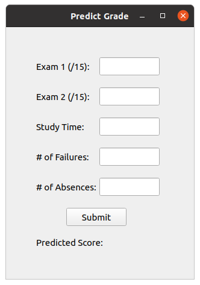

# Predict the Grade of a Student's Final Exam 
Linear Regression is a supervised machine learning algorithm where the predicted output is continuous and has a constant slope. This program uses [TensorFlow](https://www.tensorflow.org/), which is a Python library that utilizes Google's open source AI framework for machine learning and high performance numerical computation. This data is not predictive of all final exam grades; the data is taken from the [University of California, Irvine Machine Learning Repository](https://archive.ics.uci.edu/ml/index.php).   

